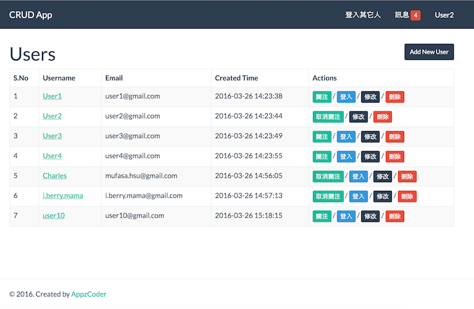
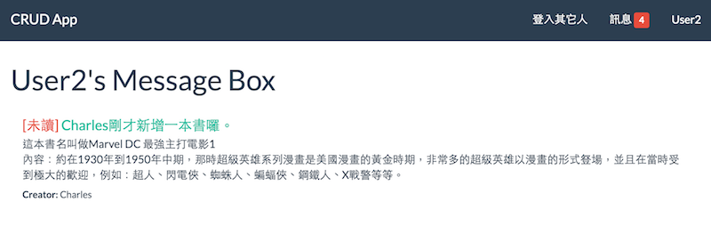

# TruBuzz Challenge

## Install docker && docker compose

Docker環境基本安裝:

* install docker (https://docs.docker.com/installation/ubuntulinux/)
```shell 
curl -sSL https://get.docker.com/ | sh
```
* install docker compose (https://docs.docker.com/compose/install/)
```shell
curl -L https://github.com/docker/compose/releases/download/1.6.0/docker-compose-`uname -s`-`uname -m` > /usr/local/bin/docker-compose
```

## 下載考題/解答環境

請下載到家目錄

```shell
$ cd ~
$ git@github.com:Easter1021/homestead-docker.git
$ cd homestead-docker
$ docker build -t shincoder/homestead .

# 將會花費少許時間安裝
```

## 建立環境

以下指令將會安裝2個容器：web container 和 mysql container，並且在 mysql container 建立 trubuzz 資料庫和具有存取權限的使用者( id: trubuzz / pw: challenge)。

```shell
$ cd ~/homestead-docker
$ docker-machine start default
$ docker-machine env
export DOCKER_TLS_VERIFY="1"
export DOCKER_HOST="tcp://192.168.99.100:2376"
export DOCKER_CERT_PATH="/Users/gexu/.docker/machine/machines/default"
export DOCKER_MACHINE_NAME="default"
# Run this command to configure your shell: 
# eval $(docker-machine env)
```

```shell
$ eval $(docker-machine env)
$ docker-compose up -d
Creating homesteaddocker_mysql_1
Creating homesteaddocker_web_1
```

現在你可以使用下列指令進入 web container 

```shell
$ ssh -p 2222 homestead@192.168.99.100
The authenticity of host '[192.168.99.100]:2222 ([192.168.99.100]:2222)' can't be established.
ECDSA key fingerprint is SHA256:VzI0s5Bt1m0FT0DsuCdLczCC3GhfR5LRtzOyXIY/0HQ.
Are you sure you want to continue connecting (yes/no)? yes
homestead@b45492bf2d7f:~$

# 其中 192.168.99.100 是 docker-machine env 的 DOCKER_HOST
# b45492bf2d7f 則是 web container 的代號
```

## 初始化環境(下載後第1次設定即可)

```shell
$ cd ~/homestead-docker/apps/trubuzz_challenge
$ php -r "copy('.env.example', '.env');"
$ Illuminate\Foundation\ComposerScripts::postInstall
$ php artisan optimize
$ php artisan key:generate
$ composer install
```

## 設定 virtual host

在本機端編輯 /etc/hosts 加入 virtual host (以下為 Mac OS 環境)

```shell
$ sudo vi /etc/hosts
##
# Host Database
#
# localhost is used to configure the loopback interface
# when the system is booting.  Do not change this entry.
##
127.0.0.1       localhost
255.255.255.255 broadcasthost
::1             localhost
fe80::1%lo0     localhost

192.168.99.100  trubuzz.challenge.test  # <--加入這行
```

## 這樣應該就可以測試了

現在，請在網址打入 [http://trubuzz.challenge.test:8000/](http://trubuzz.challenge.test:8000/) 開始測試。

## API Document

網站需要一些API，因此在路由前綴加上 `/api` 即回傳的格式為json；

像是 `/api/users` 和 `/users`，前者取得 json，後者取得 html

另外，關於 1-5 如果在API有數十甚至上百的情況下，

在沒有 cache 的情況下，將使用 `分頁` 進行效能管理。

### 建立User

```shell
// 回傳 json 格式
curl -X POST http://trubuzz.challenge.test:8000/api/users
     -F "username=Charles"
     -F "email=mufasa.hsu@gmail.com"
     
// 回傳 json 格式 (format: 1, true, True)
curl -X POST http://trubuzz.challenge.test:8000/api/users
     -F "format=True"
     -F "username=Charles"
     -F "email=mufasa.hsu@gmail.com"

// 回傳 html 格式
curl -X POST http://trubuzz.challenge.test:8000/users
     -H "Content-Type: application/x-www-form-urlencoded"
     -H "Accept: text/html" 
     -F "username=Charles"
     -F "email=mufasa.hsu@gmail.com"
```
回傳JSON內容

```#!json
{
  "username": "Charles"
  "email": "mufasa.hsu@gmail.com"
  "created_time": {
    "date": "2016-03-26 13:23:38.000000"
    "timezone_type": 3
    "timezone": "UTC"
  }
  "id": 1
}
```

### 查詢所有User

```shell
curl http://trubuzz.challenge.test:8000/api/users
```
回傳JSON內容

```#!json
{
  "total": 11
  "per_page": 15
  "current_page": 1
  "last_page": 1
  "next_page_url": null
  "prev_page_url": null
  "from": 1
  "to": 11
  "data": [11]
    0:  {
      "id": 1
      "username": "Charles"
      ....
```

<small style="color: red;">(回傳內容以下將不會解釋說明!)</small>

<small style="color: red;">(回傳內容以下將不會解釋說明!!)</small>

<small style="color: red;">(回傳內容以下將不會解釋說明!!!)</small>

### 查詢個別User

```shell
curl http://trubuzz.challenge.test:8000/api/users/1
```

### 查詢個別User所擁有的Book

```shell
curl http://trubuzz.challenge.test:8000/api/users/1/books
```

### 為User添加Book

```shell
curl -X POST http://trubuzz.challenge.test:8000/api/books
     -F "user_id=1"
     -F "title=Marvel"
     -F "description=Marvel Worldwide Inc., commonly referred to as Marvel Comics and formerly Marvel Publishing, Inc. and Marvel Comics Group, is an American publisher of comic books and related media."
```

### 為User移除Book

```shell
curl –X DELETE http://trubuzz.challenge.test:8000/api/users/1/books/1
```

### 建立Book (不要加 user_id )

```shell
curl -X POST http://trubuzz.challenge.test:8000/api/books
     -F "title=Marvel"
     -F "description=Marvel Worldwide Inc., commonly referred to as Marvel Comics and formerly Marvel Publishing, Inc. and Marvel Comics Group, is an American publisher of comic books and related media."
```

### 刪除Book

```shell
curl –X DELETE http://trubuzz.challenge.test:8000/api/books/1
```

### 修改Book

```shell
curl -X PUT http://trubuzz.challenge.test:8000/api/books/1
     -F "title=DC Comics"
     -F "description=DC Comics, Inc. is an American comic book publisher. It is the publishing unit of DC Entertainment,[2] a company of Warner Bros. Entertainment, which itself is owned by Time Warner."
```

### 查詢所有Book

```shell
curl http://trubuzz.challenge.test:8000/api/books
```

### 查詢個別Book

```shell
curl http://trubuzz.challenge.test:8000/api/books/1
```

### 查詢個別Book被誰所擁有

```shell
curl http://trubuzz.challenge.test:8000/api/books/1/user
```

## 網頁介面 (關於新書通知)

關於通知有許多作法，本系使用的是 "cmgmyr/messenger": "~2.0"

每位用戶都可以在這個頁面模擬登入，登入後可以關注其它用戶。

有2個情況，系統會發通知訊息給用戶：

1. 是用戶被關注時
2. 是關注的人發表新書時，追隨者會收到通知

登入此頁以操作功能 [http://trubuzz.challenge.test:8000/users](http://trubuzz.challenge.test:8000/users)



點擊右上角「訊息」即可查看消息列表

